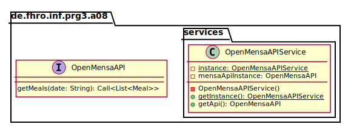
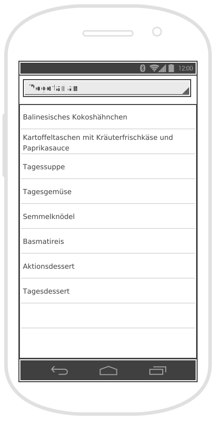
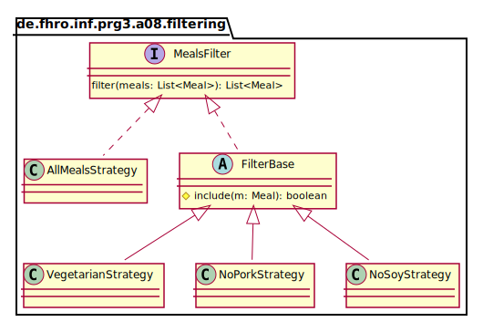
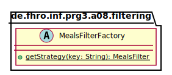

_This is an assignment to the class [Programmieren 3](https://hsro-inf-prg3.github.io) at the [University of Applied Sciences Rosenheim](http://www.fh-rosenheim.de)._

# Assignment 8: Singleton-, factory- and strategy pattern

In this assignment, we will refactor and extend the app we started to implement in the last assignment.

## Setup

1. Create a fork of this repository (button in the right upper corner)
2. Clone the project (get the link by clicking the green _Clone or download button_)
3. Import the project to your Android Studio; it behaves almost the same as IntelliJ.

## Singleton Pattern

As already explained in the lecture a singleton is an object which is accessable in your whole application at any time.
To avoid having to create a new instance of the API proxy again and again we want to implement a singleton that holds an instance of the `OpenMensaAPI` interface we implemented last time.

_Side note: depending on who you ask, Singletons are a design flaw in themselves. That might be true or not but keep in mind that Singletons should be used carefully. (Especially when they are used in multi threading applications as they may lead to unpredictable behavior.)_

The following UML shows **one possibility** how this may be accomplished:



Afterwards you can use the singleton like this:

```java
OpenMensaAPIService svc = OpenMensaAPIService.getInstance();
OpenMensaAPI apiInstance = svc.getApi();

apiInstance.getMeals(...)...
```

_Remark: IntelliJ is capable to generate singletons for you. Check the "Kind" dropdown in the class creation dialog_

## Strategy and Factory Pattern - Filters

Until now we were only able to filter for vegetarian food.
This time we want to extend the filter capabilities of our app.
The following wireframe shows the new layout of our app:



The dropdown shown in the wireframe is called a `Spinner` in Android (`select` in HTML).
[Spinners](https://developer.android.com/guide/topics/ui/controls/spinner.html) are a common design element if there are only a few choices the user can make.

Android Spinners have to different modes:

* dialog
* dropdown

_Remark: a dialog is a view element that lies over all other elements and prohibits all interactions with the underlying view elements until the dialog is closed._

You can set the mode in the XML element like this:

```xml
<!-- dialog -->
<Spinner
    android:id="@+id/dialogSpinner"
    android:spinnerMode="dialog"
    ... />

<!-- dropdown -->
<Spinner
    android:id="@+id/dropdownSpinner"
    android:spinnerMode="dropdown"
    ... />
```

Additionally to the already implemented vegetarian filter of the last assignment we want to introduce the following filtering choices:

* All - no elements are filtered (the default)
* No pork - show all meals except those containing pork
* No soy - show all meals except those containing soy

To implement the filter mechanism we could just extend the existing logic by adding some more `if-else` statements.
This approach isn't very flexible and results in a huge code statement which isn't readable any more so that's not what we want.
The strategy pattern is always a good choice if you have different implementations giving you the same **kind** of result (e.g. all implementations return a list of meals).

The following UML is meant as an implementation advise.
You don't have to implement it this way but it might result in less code (and save you time).
It is also a nice application of inheritance to avoid duplicates and reduce the amount of code.



_Additional explanations: To avoid duplicate code (DRY - don't repeat yourself!) you can extract the code to iterate over the list of meals and collect matching meals to an `abstract` base class `FilterBase` where you pass every meal to an `protected abstract` method which decides if the meal should be included or not. The `AllMealsStrategy` is handled otherwise because this strategoy does not have to filter anything._

The remaining problem is how to get an instance of the currently required strategy.
This is where the factory pattern comes into play.



A factorys responsibility is to instantiate and manage instances of different implementations of the same base class or interface.
There are different options to control which implementation is returned by the factory (e.g. enums, string keys, dumb integers, environment variables and a few more).
As the Android spinner passes the position of the element which is currently selected to the handler function (we'll cover this in a second) and the `ArrayAdater<>` implements a method to resolve the element of a given position (`getItem(int position)`) one possibility to resolve the filter is to pass the selected value of the spinner to the factory (this is the `key` parameter of the factory method `getStrategy(...)`).

1. Declare the interface `MealsFilter`
2. Implement the `AllMealsStrategy` class
3. _Optionally:_ implement the `FilterBase` class (it's totally fine for now to implement all filters without an base class)
4. Implement the filters `VegetarianStrategy`, `NoPorkStrategy`, `NoSoyStrategy`
5. Implement the `FilterFactory` class

_Remark: again the given UML for the FilterFactory is just a recommondation. You don't have to stick to this draft._

_Side note: you could implement the `getStrategy(String key)` method by doing a `switch` on the `key` parameter but it's also possible to solve it with a `Map` instance which holds the known keys and corresponding implementations and is initialized in a so called "static constructor":_

```java
public abstract class MyHelper {
    private static final String ANY_CONSTANT;

    //static constructor
    static {
        ANY_CONSTANT = "Hello, World!";
    }
}
```

## Wire up all components

The given `MainActivity` differs slightly from the one in the solution of the last assignment.
This is mainly due to the fact that it should be easier for you to perform the refactoring.

### A word about handlers

It's best practice in Android to implement the required handler interfaces (like the interface `View.OnClickListener`) as part of the activity where they are needed.
This enables you to pass just a `this` reference as handler instance to the click handler.
The following snippet should make this clear:

```java
public class MainActivity extends AppCompatActivity implements View.OnClickListener {
    //...

    @Override
    protected void onCreate(Bundle savedInstanceState) {
        super.onCreate(savedInstanceState);
        setContentView(R.layout.activity_main);

        //retrieve a reference to the button
        Button b = findViewById(R.id.my_button);

        //pass 'this' as OnClickListener
        b.setOnClickListener(this);
    }

    @Override
    public void onClick(View view) {
        // handle the click event
    }
}
```

### A word about the Android spinner

The mechanism to pass values to an Android spinner is pretty much the same like to pass values into a `ListView`.
You need to set an `ArrayAdapter<>` instance (or a subclass of it) at the spinner instance and pass the values to display to the `ArrayAdapter<>`.

_Side note: don't get confused, the given source code does not pass the values directly but loads them from the file `strings.xml` as this is best practice for internatialization (i18n) but that's a topic for later._

To get notified whenever the selected value of a spinner changes it offers the method `setOnItemSelectedListener(AdapterView.OnItemSelectedListener listener)`.
The signature of the interface `AdapterView.OnItemSelectedListener` looks like this:

```java
public interface OnItemSelectedListener {
    void onItemSelected(AdapterView<?> parent, View view, int position, long id);

    void onNothingSelected(AdapterView<?> parent);
}
```

It's on you to decide if you want to pass the handler as an anonymous inner class or to implement the interface within your `MainActivity` class and pass a `this` reference as handler.
Keep in mind that regardless of which variant you choose, you **must** implement both interface methods (`onItemSelected(...)` and `onNothingSelected(...)`).

1. Register an `AdapterView.OnItemSelectedListener` at the `filterSpinner` instance.
2. Retrieve a reference to the `OpenMensaAPIService` in the implementation of the method `onItemSelected(...)`. `enqueue(...)` an call and handle the result with an implementation of `Callback<>` (again: choose one of the two described methods how handlers can be implemented).
3. Resolve the currently selected string value as already described (_hint: `getItem(int position`_).
4. Get an instance of the `MealsFilter` interface by using your `MealsFilterFactory` implementation.
5. Filter the retrieved list of meals and pass them to the `ListView` by adding them to the `mealsArrayAdapter` (remember to `clear` the adapter previously).